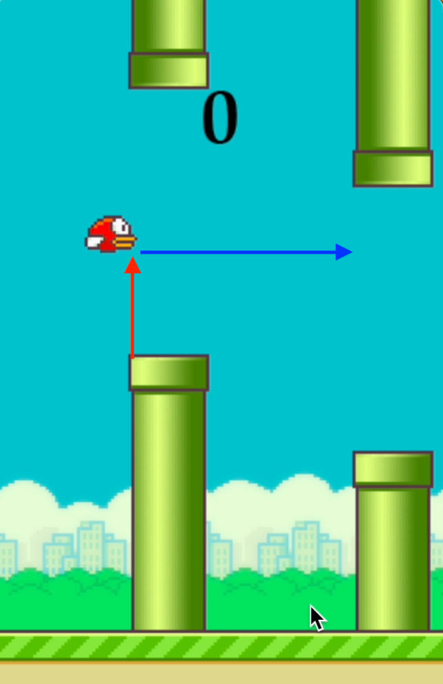

# Flappy Bird Genetic Algorithm

This is a modified Flappy Bird game that can run multiple agents inside the environment of the game.
Throughout multiple generations, the agents will slowly optimize to the surrounding obstacles.

Check out the [research paper](CSCI4511W_Final_Project_Writeup.pdf) written about this repository.
